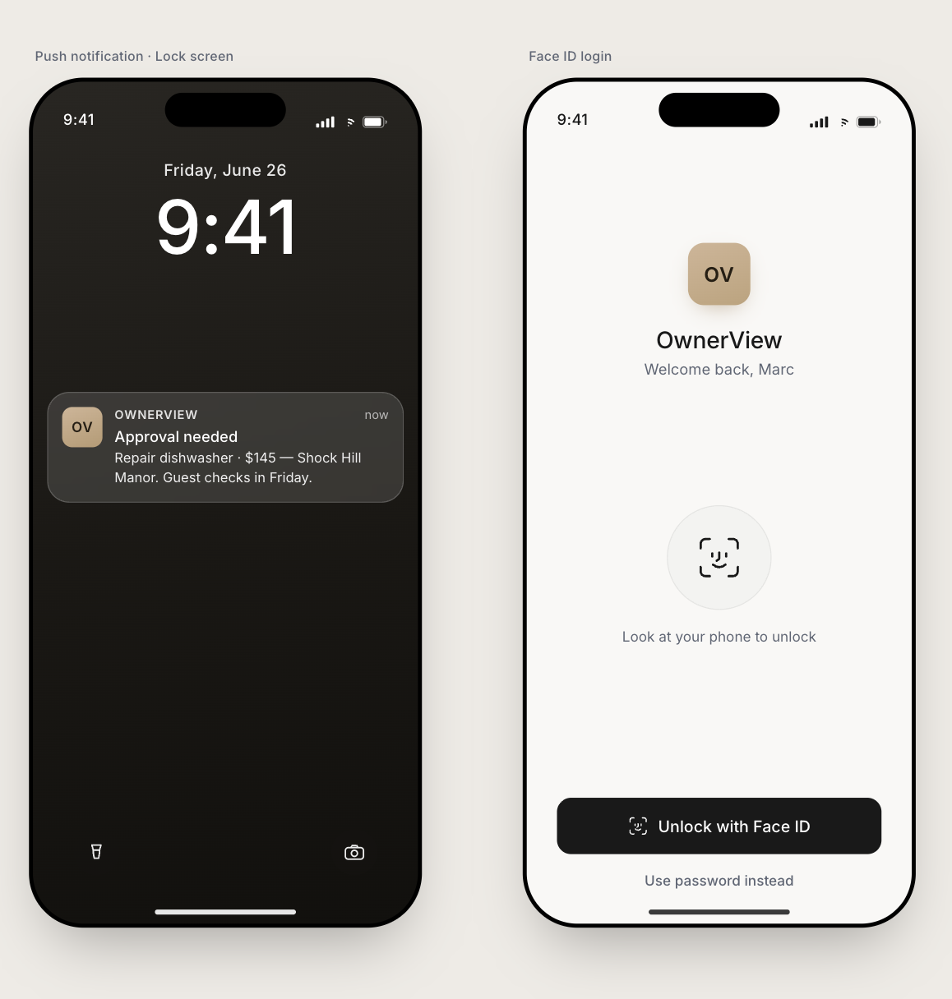
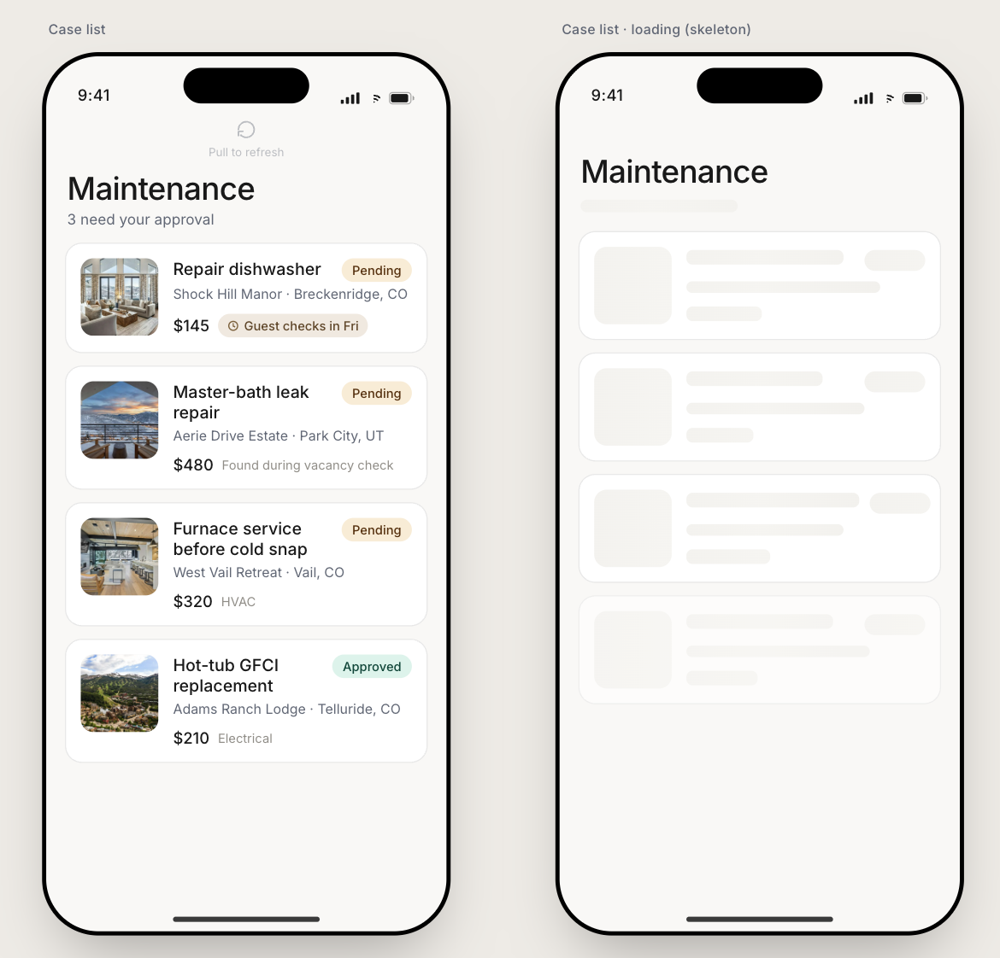
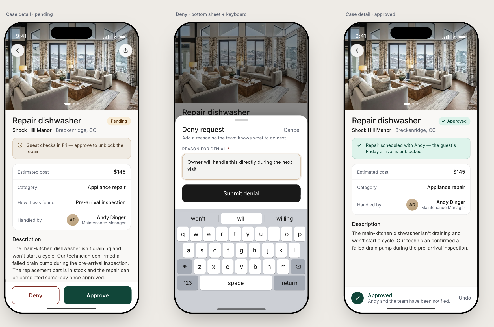

# OwnerView

A small React Native (Expo) app that lets property owners review and approve
maintenance cases from their phone. An owner gets a push that a case needs a
decision, opens straight into it (cost, vendor, photos, guest context), and
either approves in one tap or denies with a reason. The goal is to turn a
decision that used to take days into one that takes seconds.

The app code lives in the `ownerview/` folder.

## Useful links

- [How the project is built and the rules we follow (CLAUDE.md)](./CLAUDE.md)
- [System design / why we made each choice](./ownerview/docs/design.md)
- [Design brief](./ownerview/docs/design-brief.md)
- [Design tokens](./ownerview/docs/design-tokens.md)
- [Implementation guide (iteration 1)](./ownerview/docs/implementation-guide-iteration-1.md)
- [App README (Expo specifics)](./ownerview/README.md)

## Screenshots

Push notification, lock screen, and Face ID login:



The case list, sorted by urgency, plus the skeleton loading state:



Case detail, the deny bottom sheet, and the approved state:



## What's in it

- One-tap approve, or deny with a reason.
- A case list that sorts itself so the most urgent case shows up first (it
  factors in things like when the next guest checks in).
- Face ID lock over a saved session, with a tap-to-unlock fallback if biometrics
  aren't available.
- Native touches: optimistic writes with haptics, skeleton loaders,
  pull-to-refresh, and a bottom sheet for the deny flow.
- Runs on iOS, Android, and the web from the same code.

## How the code is organized

- `ownerview/src/core` — the shared logic: types, Zod validation, data access,
  business rules (urgency, sorting, can-approve/can-deny), and formatting. No UI
  here, so a future Next.js web app could reuse it as-is.
- `ownerview/src/app` — the screens and navigation (Expo Router, file-based).
- `ownerview/src/components`, `screens`, `auth`, `lib`, `data` — UI pieces and
  anything that touches the device (SecureStore, Face ID, haptics).

Rule of thumb: if it isn't pixels, navigation, or a device API, it belongs in
`core`.

## How to run it

You'll need Node and the Expo tooling. It runs with mock data by default, so you
don't need any API keys or accounts to try it.

```bash
cd ownerview
npm install
npx expo start
```

From the Expo output you can:

- Press `i` to open the iOS simulator.
- Press `a` to open the Android emulator.
- Press `w` to open it in the web browser.
- Or scan the QR code with the Expo Go app on your phone.

## Good to know

- TypeScript is in strict mode. Data is validated at the edges with Zod, and the
  types come from those schemas so we don't write them twice.
- Secrets never go in AsyncStorage. Tokens live in Expo SecureStore, and we store
  the refresh token, not the password.
- Access control is meant to live in the database (Supabase RLS), not the client.
  The Supabase adapter is wired up, but mock data is the default.
